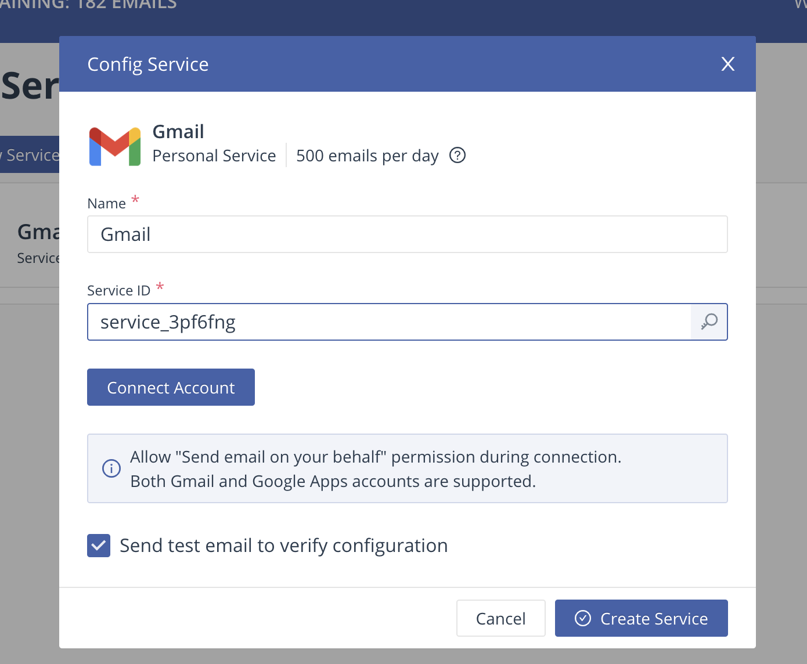
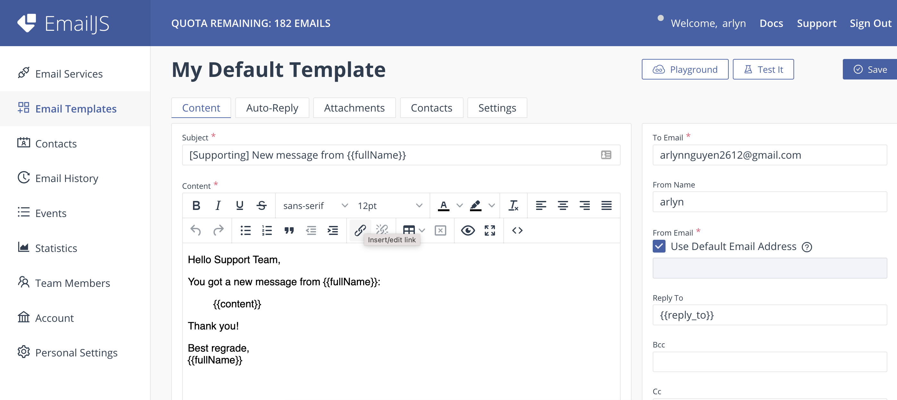

# React-Emailjs

Send message to email via emailjs

#### Step by steps:

- Create an account emailjs: https://www.emailjs.com/
- Adding an email service:
- 
- Creating an email template:
- 

## Installation & Run

- Fork and Clone this Repo: `https://github.com/Hopnguyen2601/sharing.git`
- Switch to feature/emailjs branch
- Run command: `npm install`
- Add on your EmailJs Service id , User id and template id in the App.js file
- Run command: `npm start`
- View app at browser: `http://localhost:3000/`
